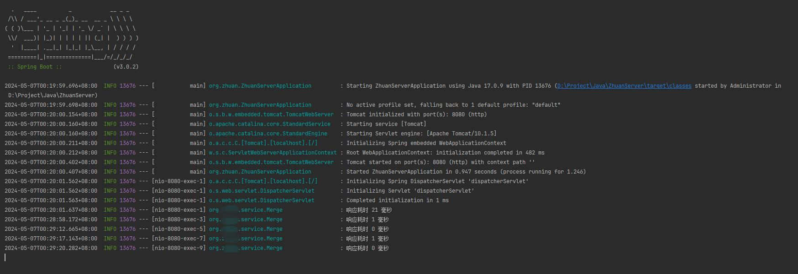
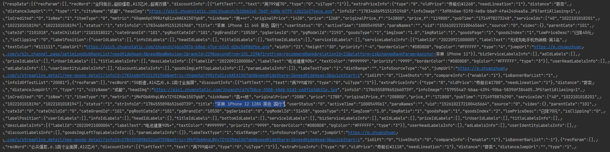
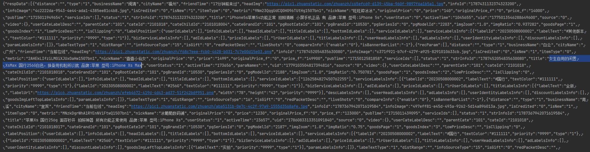

# zhuanzhuan_sign
探寻转转签名/算法

```
本篇文章仅供学习讨论。

文章中涉及到的代码、实例，仅是个人日常学习研究的部分成果。

如有不当，请联系删除。
```

在研究完阿里的算法以后（其实很难说研究完，还有很多内容没有研究透，只能说暂时告一段落）（[念念不忘，必有回响。研究阿里系签名，获益良多——unidbg/idlefish/taobao/damai](https://github.com/FightingForWhat/unidbg_idle_fish)），又重新看了下转转的签名算法。

相对来说，tx在这方面就做得比较友好了。算法感觉比较新颖，但也相对来说比阿里的简单很多。阿里签名的复杂程序，我是一直耿耿于怀的。

反观转转，可能是因为tx在保护自己知识产权等等方面有南山必胜客的胜名，在用户使用应用方面，就显得友好很多了，不管是请求数据，还是风控方面。这里应该为tx点个赞的。

那么，直接来一波炫技吧：


因为直接逆向了算法，所以响应起来还是很快的，基本不耗时。


搜索内容，依然是我个人测试最喜欢的"iphone"


官方验和自由市场部分数据都已经成功实现

本来想继续看转转在详情页面的实现情况，但发现详情页面的实现其实很简单，也就不做多研究了。
